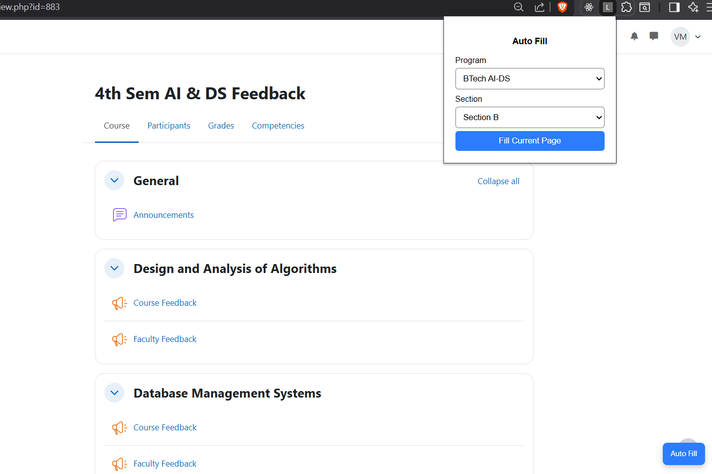
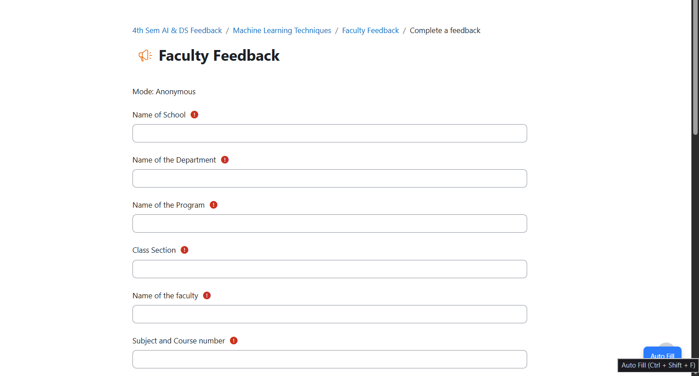
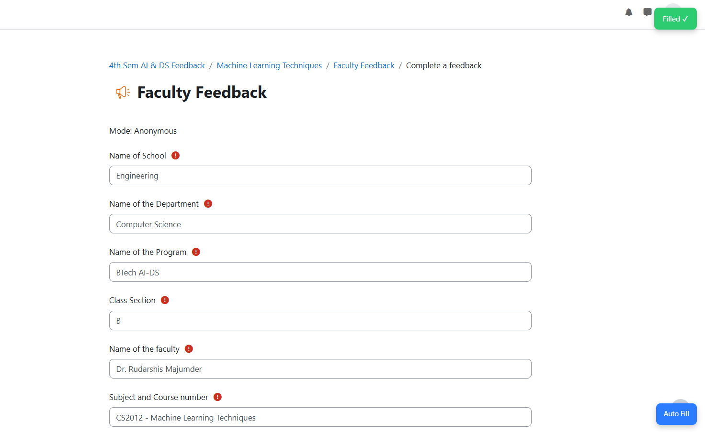

# 🚀 SNU Feedback Assistant

A Chrome extension that automatically fills Moodle **course feedback** and **faculty feedback** forms for SNU Chennai students.

---

## ✨ Features

* 🧠 Auto-detects course name from Moodle
* 🔢 Automatically fills **course code + name**
* 👨‍🏫 Fills **faculty name based on section (A/B)**
* 🎛️ Simple popup UI to select:

  * Program (AI-DS / IoT / Cyber)
  * Section (A / B)
* 🟦 Floating **“Auto Fill” button** on page
* ⌨️ Keyboard shortcut: `Ctrl + Shift + F`
* ✅ Success toast notification
* 🔒 **No auto-submit** (you stay in control)

---

## 📸 Screenshots

### 🔹 Popup UI



### 🔹 Floating Button



### 🔹 Filled Feedback Form



---

## ⚙️ Installation (Manual)

Since this extension is not on the Chrome Web Store, follow these steps:

### 1. Download the project

* Click **Code → Download ZIP**
* Extract the folder

---

### 2. Open Chrome Extensions

Go to:

```
chrome://extensions/
```

---

### 3. Enable Developer Mode

* Toggle **Developer mode** (top right)

---

### 4. Load the extension

* Click **Load unpacked**
* Select the extracted folder

---

### 5. Done ✅

You’ll now see **SNU Feedback Assistant** in your extensions.

---

## 🧪 How to Use

1. Open your Moodle feedback page
2. Click the extension icon
3. Select:

   * Program
   * Section
4. Click **Fill Current Page**

OR

👉 Use shortcut:

```
Ctrl + Shift + F
```

OR

👉 Click the floating **Auto Fill** button on the page

---

## 🎯 What It Does

* Fills all text fields
* Selects appropriate radio options
* Inserts course code + name
* Fills faculty name based on section

---

## ⚠️ Important Notes

* ❌ Does NOT auto-submit forms
* ❌ Does NOT navigate pages
* ✔ You remain in full control

---

## 🛠️ Tech Stack

* JavaScript (Vanilla)
* Chrome Extensions (Manifest V3)
* DOM Automation

---

## 📌 Supported Programs

Currently supports:

* BTech AI-DS (A & B)
* (Expandable to IoT / Cyber)

---

## 🔮 Future Improvements

* Add IoT & Cyber faculty mappings
* Randomized answer mode
* Better UI controls
* Multi-course automation

---

## 🤝 Contributing

Feel free to fork and improve the project!

---

## 📜 License

For educational use only.

---

## 🙌 Acknowledgement

Built to simplify repetitive Moodle feedback workflows for students.
